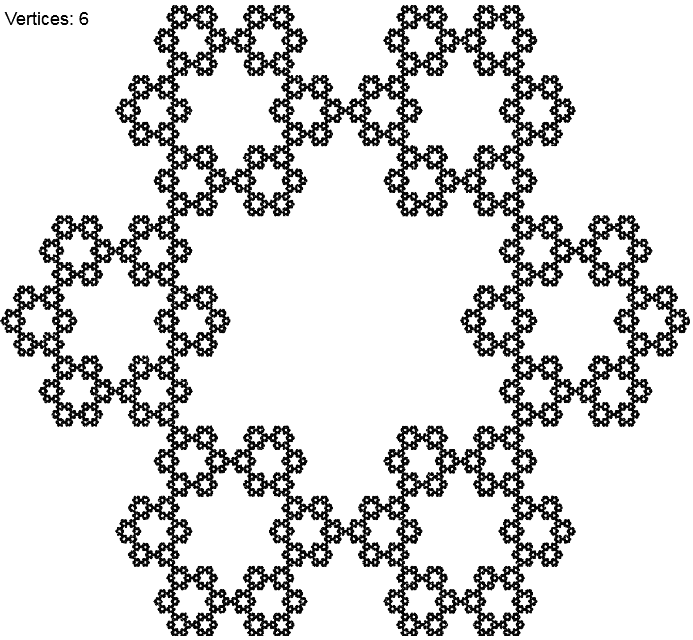

### Sierpinski Gasket, Hexagon and Carpet

Sierpinski Gasket, Hexagon and Carpet with 3, 6 and 8 vertices respectively.
You can change their size dynamically by resizing your browser's window.
After resizing the image is smoothly redrawn.

Sierpinski Gasket (3 vertices):

Sierpinski Hexagon (6 vertices):

Sierpinski Carpet (8 vertices):

