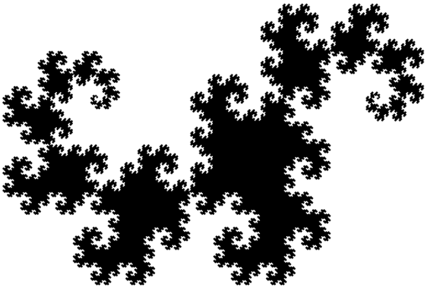
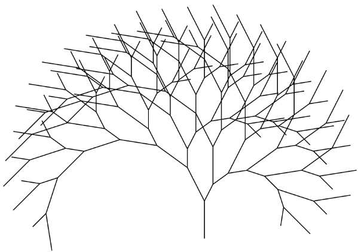
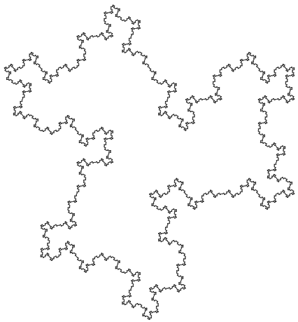
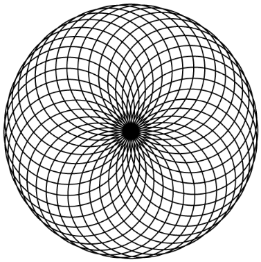
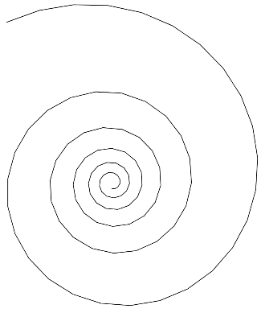
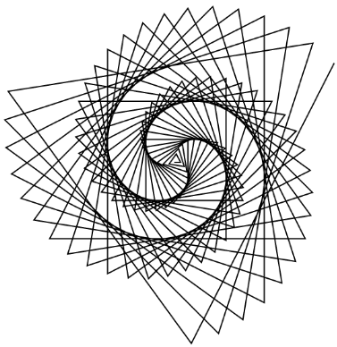
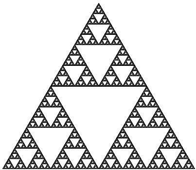
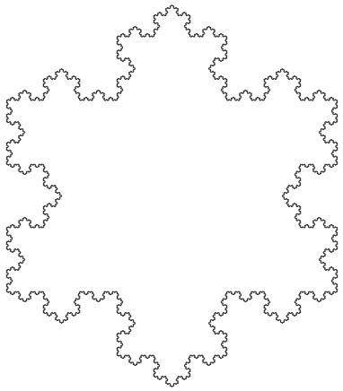
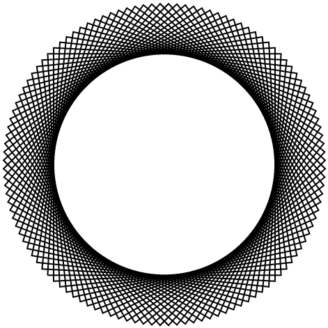

### Turtle Library

Implementation of the "Turtle Library".
Imagine that you're turtle crawling on a plane.
There are only 2 actions: move forward or turn left-right on some angle.
It is possible to create huge number of unique and beautiful
fractals using only two actions. And encode these actions in some
"words" (see further implementations of
[Lindenmayer Systems](../04_Lindenmayer_systems)).

You can resize some of these drawings by changing browser's window.

Dragon:

Tree:

Zig-zag Flake:

Cycles:

Helix:

Spiral:

Sierpinski Gasket:

Koch Snowflake:

Cycle:

