### Lindenmayer systems

[Lindenmayer Systems or L-systems](https://en.wikipedia.org/wiki/L-system)
were first outlined by Aristid Lindenmayer as a method for modeling the growth
of algae and fungi. Through the work of fractal pioneers like Michael Barnsley and others,
L-Systems have been created for fractals like the Harter-Heighway dragon,
the Hilbert curve, and several methods for the Sierpinski Gasket.

L-System is a grammar for drawing fractals. L-Systems grow by parsing a string
character by character to build a new string. Each character is either added
directly to the new string, or replaced by a sequence of characters outlined
by our replacement rules. Initial string is called the Axiom and is often used
to define the initial shape of the fractal.

H-figure:

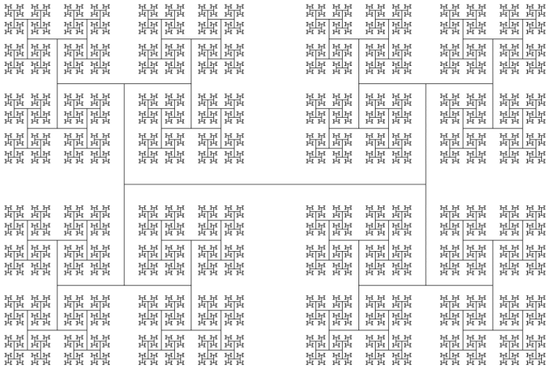

Bent H-figure:

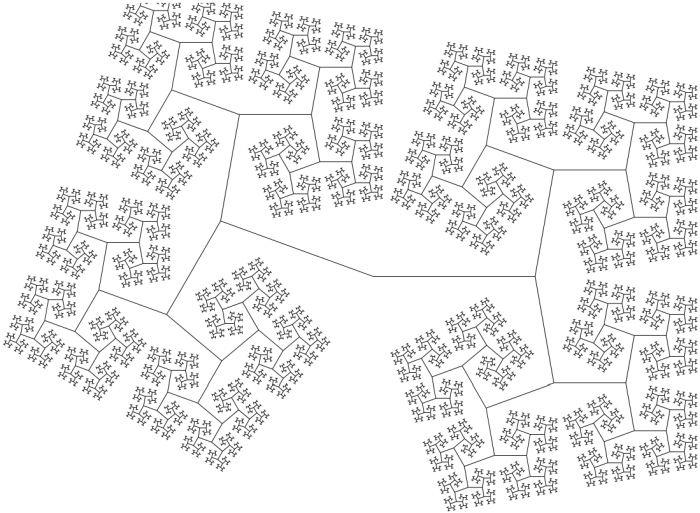

Spiky Square:

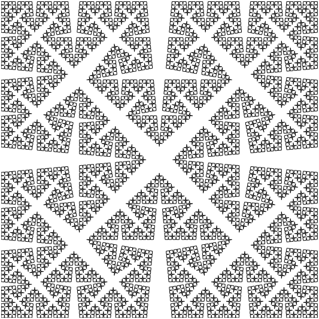

Square Islands:

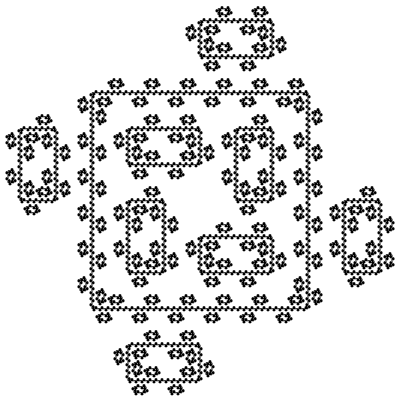

Penrose Tilings:

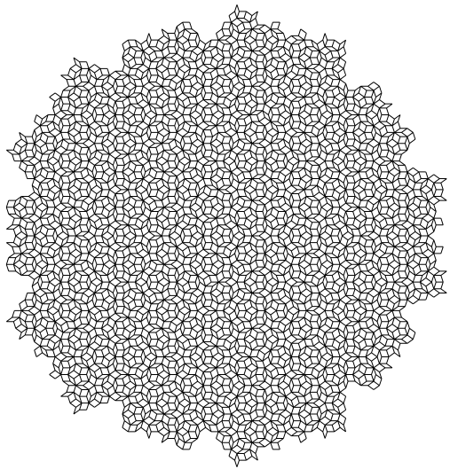

Arrowhead Gasket:

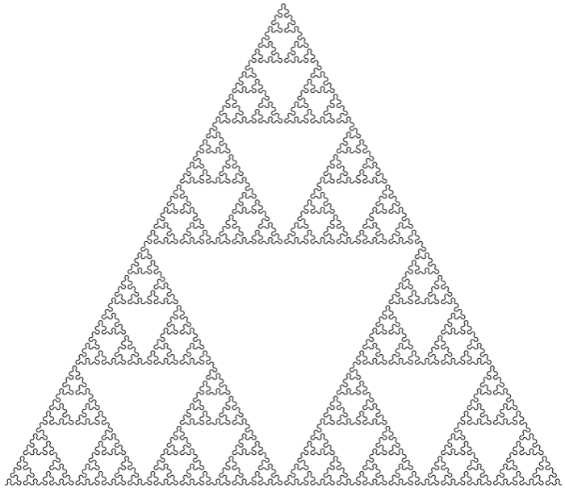

Koch Square:

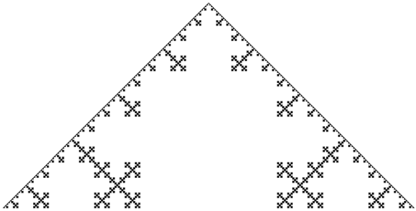

L-system with recursion:

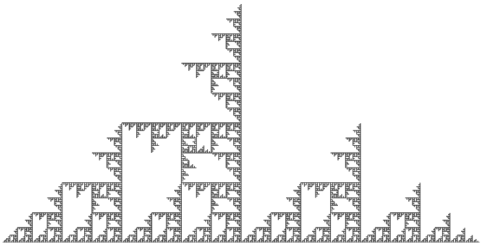

L-system Dragon:

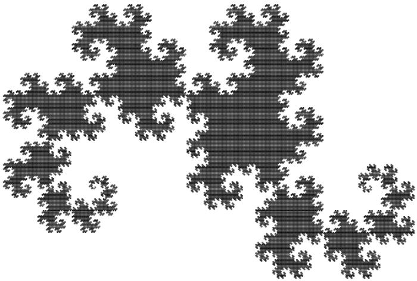

Turtle Dragon:

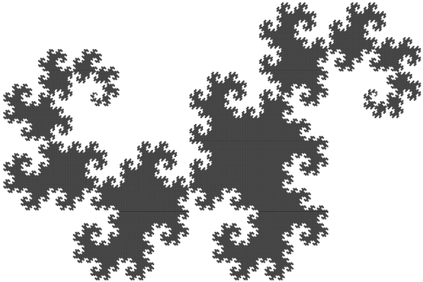

Turtle Koch Square curve:

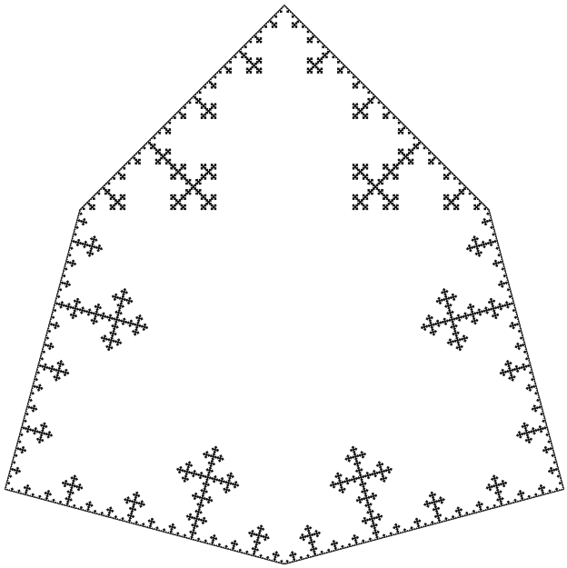

Recursion Tree:

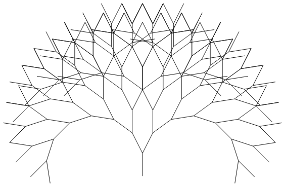
