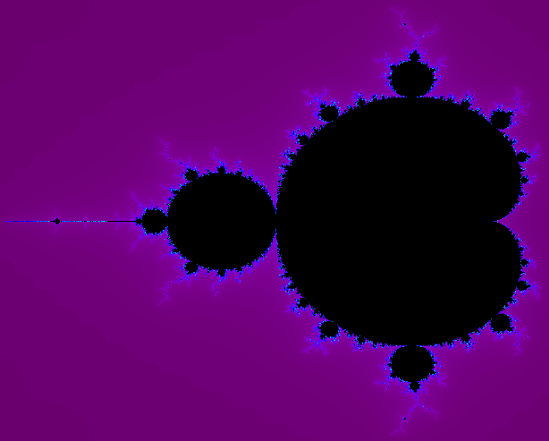
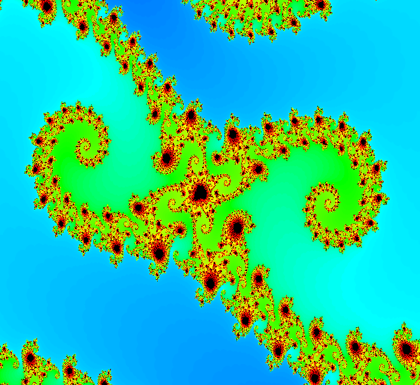
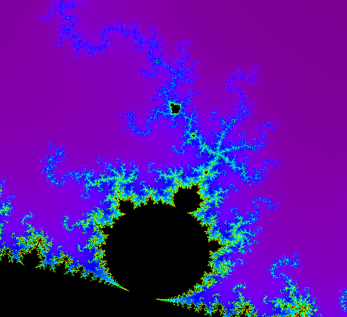

### Mandelbrot set

The [Mandelbrot set](https://en.wikipedia.org/wiki/Mandelbrot_set) is the set
of complex numbers *c* for which the function *f(z) = z^2 + c*
does not diverge when iterated from *z = 0*, i.e., for which the sequence
f(0), f(f(0)), f(f(f(0))), etc., remains bounded in absolute value.

The set is connected to a Julia set, and related Julia sets produce
similarly complex fractal shapes.

