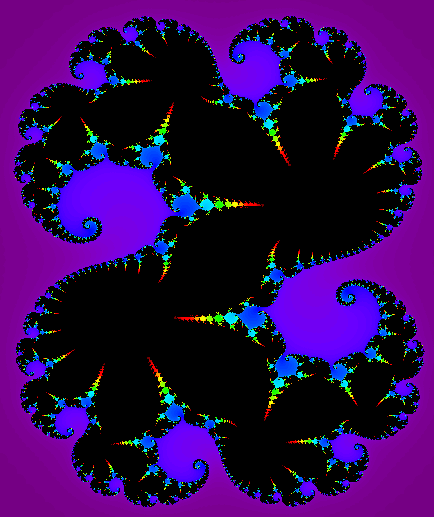
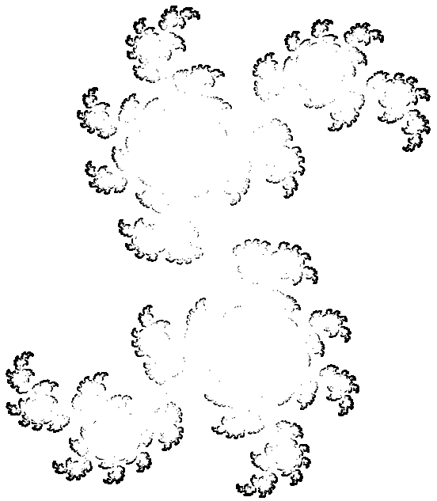

### Julia set

Julia set is a set of complex numbers which do not converge to any limit
when a given mapping is repeatedly applied to them. In some cases the result
is a connected fractal set. It was  named after Gaston M. Julia (1893–1978),
Algerian-born French mathematician.

