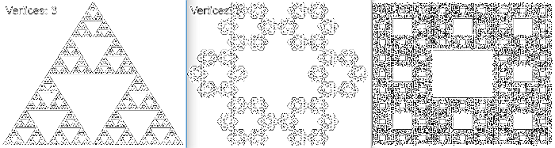

## Fractals drawing

I've used the book of [**Ben Trube "Fractals: A Programmer's Approach"**](
https://www.amazon.com/Fractals-Programmers-Approach-Ben-Trube-ebook/dp/B00E9W1W5W).
However, all software was rewritten from C++ to Javascript to make it
available online, without sophisticated compilation and additional libraries.

Use IDE (integrated development environment)
**JetBrains WebStorm Community Edition**
to make your experiments with the source codes easier.

Tested mostly on Firefox browser, but it should work on any browser
with Javascript support. *No additional libraries required*.

### 1.1 [Chaos game](01.1_Chaos_Game) is a "fractal player" on Javascript.

Run HTML file and control fractal drawing with your keyboard.
Pause, resume, forward and backward random fractal drawing
with {Space}, →, ←, ↑, ↓ keys. Turn on/off color mode with
{1} and {2} keys. Black-and-white drawing is faster.

### 1.2 [Chaos game with rotation](01.2_Chaos_Game_Rotation)

The same as previous [chaos game](01.1_Chaos_Game), but rotation
is added to the drawing procedure.

### 1.3 [Random Sierpinski Gasket](01.3_Random_Sierpinski_Gasket)

Random Sierpinski Gasket is a Sierpinski Gasket with random triangles.
It is different every time you press {F5} key and reload page.

### 2.1 [Sierpinski Gasket, Hexagon and Carpet](02.1_Sierpinski_Gasket)

Sierpinski Gasket, Hexagon and Carpet with 3, 6 and 8 vertices respectively.
You can change their size dynamically by resizing your browser's window.
After resizing the image is smoothly redrawn.

### 2.2 [Ferns](02.2_Ferns)

There are three types of fractal ferns presented:
Barnsley Fern (the most beautiful), Simple Fern and Spirals.
You can change their size dynamically by resizing your browser's window.
After resizing the image is smoothly redrawn.

Barnsley Fern:

Simple Fern:

Spirals:

### 2.3 [Recursion Figure](02.3_Recursion_Figure)

Draw the fractal recursively with depth of 12.

### 3. [Turtle Library](03_Turtle_Library)

Implementation of the "Turtle Library".
Imagine that you're turtle crawling on a plane.
There are only 2 actions: move forward or turn left-right on some angle.
It is possible to create huge number of unique and beautiful
fractals using only two actions. And encode these actions in some
"words" (see further implementations of
[Lindenmayer Systems](04_Lindenmayer_Systems)).

You can resize some of these drawings by changing browser's window.

Dragon, Tree and Zig-zag:

Cycles, Helix and Spiral:

Sierpinski Gasket, Koch Snowflake and Cycle:

### 4. [Lindenmayer systems](04_Lindenmayer_Systems)

[Lindenmayer Systems or L-systems](https://en.wikipedia.org/wiki/L-system)
were first outlined by Aristid Lindenmayer as a method for modeling the growth
of algae and fungi. Through the work of fractal pioneers like Michael Barnsley and others,
L-Systems have been created for fractals like the Harter-Heighway dragon,
the Hilbert curve, and several methods for the Sierpinski Gasket.

L-System is a grammar for drawing fractals. L-Systems grow by parsing a string
character by character to build a new string. Each character is either added
directly to the new string, or replaced by a sequence of characters outlined
by our replacement rules. Initial string is called the Axiom and is often used
to define the initial shape of the fractal.

H-figure, Bent H-figure, Spiky Square and Square Islands:

Penrose Tilings, Arrowhead Gasket, Koch Square figure and L-system with recursion:

### 5. [Mandelbrot set](05_Mandelbrot_Set)

The [Mandelbrot set](https://en.wikipedia.org/wiki/Mandelbrot_set) is the set
of complex numbers *c* for which the function *f(z) = z^2 + c*
does not diverge when iterated from *z = 0*, i.e., for which the sequence
f(0), f(f(0)), f(f(f(0))), etc., remains bounded in absolute value.

The set is connected to a Julia set, and related Julia sets produce
similarly complex fractal shapes.

### 6. [Julia set](06_Julia_Set)

Julia set is a set of complex numbers which do not converge to any limit
when a given mapping is repeatedly applied to them. In some cases the result
is a connected fractal set. It was  named after Gaston M. Julia (1893–1978),
Algerian-born French mathematician.

